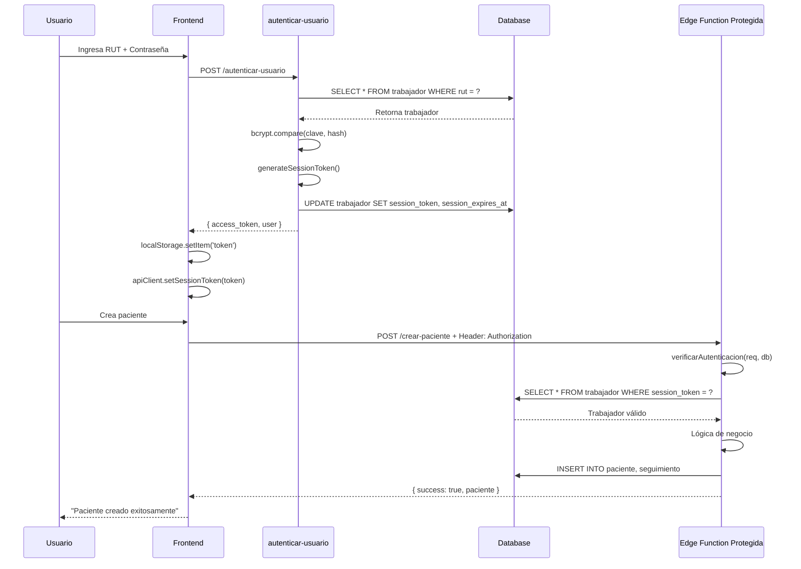

# Sistema de Seguridad - Aplicación de Lista de Espera USS

## 📋 Resumen

La aplicación utiliza un sistema de autenticación basado en **Session Tokens** almacenados en la base de datos. Este enfoque es más simple que JWT pero suficientemente seguro para el alcance del proyecto.

---

## 🔐 Arquitectura de Seguridad

### 1. **Autenticación (Login)**

**Endpoint:** `autenticar-usuario`  
**Tipo:** Público (sin autenticación previa)  
**Flags de deploy:** `--no-verify-jwt`

**Flujo:**
1. Usuario envía RUT y contraseña
2. Backend valida credenciales:
   - Busca trabajador por RUT
   - Verifica contraseña con bcrypt
   - Valida que usuario esté activo (`activo = true`)
3. Si es válido:
   - Genera token aleatorio de 64 caracteres
   - Almacena en `trabajador.session_token`
   - Establece `session_expires_at = NOW() + 1 hora`
   - Retorna token al cliente

**Respuesta:**
```json
{
  "access_token": "abc123...xyz789",
  "refresh_token": "abc123...xyz789",
  "expires_at": "2025-12-21T23:30:00Z",
  "user": {
    "id_trabajador": 1,
    "rut": "12345678-9",
    "rol": "jefe",
    "nombre": "Admin",
    "apellido": "Sistema"
  }
}
```

---

### 2. **Autorización (Validación de Requests)**

**Módulo compartido:** `supabase/functions/_shared/auth.ts`

#### Funciones Helper:

##### `verificarAutenticacion(req, supabaseClient)`
Valida que el request tenga un token válido y no expirado.

**Proceso:**
1. Extrae token del header `Authorization: Bearer <token>`
2. Busca en base de datos:
   ```sql
   SELECT * FROM trabajador
   WHERE session_token = '<token>'
     AND session_expires_at > NOW()
     AND activo = true
   ```
3. Si no existe o expiró → `Error: Sesión inválida o expirada`
4. Si existe → Retorna datos del trabajador autenticado

**Retorno:**
```typescript
{
  id_trabajador: number,
  rut: string,
  rol: 'jefe' | 'usuario',
  nombre: string,
  apellido: string,
  activo: boolean
}
```

##### `verificarRol(trabajador, rolesPermitidos)`
Valida que el usuario tenga un rol específico.

**Uso:**
```typescript
const trabajador = await verificarAutenticacion(req, supabaseClient);
verificarRol(trabajador, ['jefe']); // Solo Admin Jefe puede continuar
```

---

### 3. **Clasificación de Edge Functions**

#### **A) Funciones PÚBLICAS** (sin autenticación)

| Función | Deploy Flags | Uso |
|---------|--------------|-----|
| `autenticar-usuario` | `--no-verify-jwt` | Login |
| `obtener-datos-autocompletar` | `--no-verify-jwt` | Catálogos públicos |
| `verificar-rut` | `--no-verify-jwt` | Validación de RUT |

**Características:**
- Usan `SUPABASE_SERVICE_ROLE_KEY` (bypass RLS)
- No validan session token
- Retornan solo datos públicos

---

#### **B) Funciones PROTEGIDAS** (requieren autenticación)

Todas las demás funciones requieren validación de token.

**Deploy:** Sin flags especiales (JWT verification habilitado por defecto)

##### **B.1) Funciones de Usuario (jefe y usuario)**

| Función | Permisos | Descripción |
|---------|----------|-------------|
| `crear-paciente` | Todos | Registrar nuevo paciente |
| `buscar-paciente-rut` | Todos | Buscar paciente por RUT |
| `buscar-pacientes-filtros` | Todos | Búsqueda con filtros |
| `actualizar-seguimiento` | Todos | Actualizar seguimiento |
| `obtener-datos-usuario` | Todos | Obtener datos del usuario |
| `estadisticas-historicas` | Todos | Ver estadísticas |
| `cerrar-sesion` | Todos | Invalidar token |

**Validación:**
```typescript
// Solo validar autenticación
const trabajador = await verificarAutenticacion(req, supabaseClient);
// Continuar con lógica...
```

---

##### **B.2) Funciones de Admin Jefe (solo rol "jefe")**

| Función | Descripción |
|---------|-------------|
| `listar-usuarios` | Ver todos los trabajadores |
| `registrar-usuario` | Crear nuevo trabajador |
| `cambiar-contrasena` | Resetear contraseña |
| `archivar-usuario` | Activar/desactivar usuario |
| `gestion-comunas` | CRUD catálogo comunas |
| `gestion-especialidades` | CRUD catálogo especialidades |
| `gestion-instituciones` | CRUD catálogo instituciones |
| `gestion-origenes` | CRUD catálogo orígenes |
| `historial-cambios-paciente` | Ver auditoría completa |
| `ingresos-por-ejecutivo` | Ver KPIs por ejecutivo |

**Validación:**
```typescript
const trabajador = await verificarAutenticacion(req, supabaseClient);
verificarRol(trabajador, ['jefe']); // Solo Admin Jefe
```

**Excepción:** En funciones de gestión de catálogos, la acción `'listar'` NO requiere rol jefe:
```typescript
const trabajador = await verificarAutenticacion(req, supabaseClient);

if (action !== 'listar') {
  verificarRol(trabajador, ['jefe']); // Solo para crear/editar/archivar
}
```

---

### 4. **Cierre de Sesión**

**Endpoint:** `cerrar-sesion`  
**Método:** Invalidación de token

**Proceso:**
1. Valida que el token sea válido
2. Actualiza registro en base de datos:
   ```sql
   UPDATE trabajador
   SET session_token = NULL,
       session_expires_at = NULL
   WHERE id_trabajador = <id>
   ```
3. El frontend elimina el token de `localStorage`

**Resultado:** El token queda invalidado y no puede usarse nuevamente.

---

## 🛡️ Medidas de Seguridad Implementadas

### ✅ **Implementado**

1. **Contraseñas hasheadas con bcrypt** (10 rounds)
2. **Session tokens aleatorios** (64 caracteres)
3. **Expiración de tokens** (1 hora)
4. **Validación de tokens en cada request** protegido
5. **Control de acceso basado en roles** (RBAC)
6. **Usuarios inactivos no pueden autenticarse**
7. **Tokens invalidados al cerrar sesión**
8. **HTTPS obligatorio** (provisto por Supabase)
9. **CORS configurado** (permite solo orígenes específicos)
10. **SERVICE_ROLE_KEY protegida** (solo en backend)

---

### 🔒 **Recomendaciones Adicionales** (opcional)

1. **Rate Limiting:** Limitar intentos de login (Supabase lo provee nativamente)
2. **Rotación de tokens:** Generar nuevo token en cada request
3. **Refresh tokens separados:** Tokens de corta duración + refresh de larga duración
4. **2FA:** Autenticación de dos factores para Admin Jefe
5. **Logs de auditoría:** Registrar todos los accesos y cambios (parcialmente implementado con triggers)
6. **IP whitelisting:** Restringir acceso desde IPs específicas
7. **Encriptación de datos sensibles:** Usar `pgcrypto` para campos críticos

---

## 📊 Flujo Completo de Autenticación



---

## 🔍 Debugging

### Verificar si un token es válido:

```sql
SELECT id_trabajador, rut, rol, nombre, apellido,
       session_expires_at > NOW() AS token_valido,
       session_expires_at
FROM trabajador
WHERE session_token = '<token_aqui>';
```

### Ver todas las sesiones activas:

```sql
SELECT id_trabajador, rut, nombre, apellido, rol,
       session_expires_at
FROM trabajador
WHERE session_token IS NOT NULL
  AND session_expires_at > NOW()
ORDER BY session_expires_at DESC;
```

### Invalidar todas las sesiones:

```sql
UPDATE trabajador
SET session_token = NULL,
    session_expires_at = NULL
WHERE session_token IS NOT NULL;
```

---

## 📝 Cambios Realizados en el Código

### 1. Creado módulo compartido de autenticación
- **Archivo:** `supabase/functions/_shared/auth.ts`
- **Funciones:** `verificarAutenticacion()`, `verificarRol()`

### 2. Actualizada autenticación en funciones
- **Modificadas:** 17 funciones protegidas
- **Cambios:**
  - Importan módulo `_shared/auth.ts`
  - Usan `SUPABASE_SERVICE_ROLE_KEY` (antes ANON_KEY)
  - Llaman `verificarAutenticacion()` al inicio
  - Eliminado parámetro `userRole` del body

### 3. Frontend ya configurado correctamente
- **Archivo:** `frontend/src/api/client.ts`
- **Header:** `Authorization: Bearer <token>` se envía automáticamente
- **Token:** Almacenado en `localStorage` y `ApiClient`

---

## ✅ Próximos Pasos

1. **Probar el sistema:**
   - Login con credenciales válidas
   - Crear paciente (debe funcionar con token)
   - Intentar acceso sin token (debe rechazar)
   - Verificar que Admin Jefe puede gestionar catálogos
   - Verificar que usuario normal NO puede gestionar catálogos

2. **Monitorear logs:**
   - Ver logs de Supabase Edge Functions
   - Detectar intentos de acceso no autorizados
   - Revisar errores de validación

3. **Consideraciones de producción:**
   - Configurar CORS con dominio específico (no `*`)
   - Implementar rate limiting
   - Establecer política de rotación de contraseñas
   - Documentar procedimientos de recuperación de cuentas
